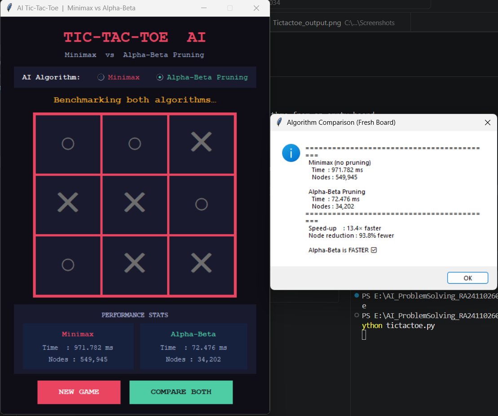
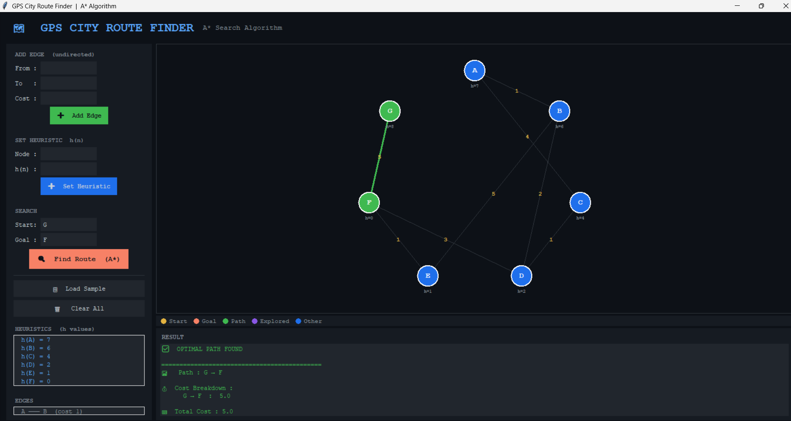

# AI Problem Solving — GitHub Assignment

> **Course:** Artificial Intelligence  
> **Team Size:** 2 members  
> **Deadline:** 25 April 2026

---

## 📁 Repository Structure

```
AI_ProblemSolving_<RegisterNumber>/
├── Problem1_TicTacToe/
│   ├── tictactoe.py          ← Main game (Minimax + Alpha-Beta)
│   └── README.md
├── Problem11_CityRouteFinder/
│   ├── city_route_finder.py  ← A* GPS route finder
│   └── README.md
├── .gitignore
└── README.md                 ← (this file)
```

---

## Problem 1 — Interactive Game AI (Tic-Tac-Toe)

### Case Study
A gaming company wants an AI opponent for a web-based Tic-Tac-Toe game.
The AI always makes the best possible move.

### Algorithms Used
| Algorithm | Description |
|---|---|
| **Minimax** | Exhaustively explores all game states to find the optimal move |
| **Alpha-Beta Pruning** | Minimax with branch-cutting; skips states that cannot improve the result |

### How to Run
```bash
cd Problem1_TicTacToe
python tictactoe.py
```

### Requirements
- Python 3.x (tkinter is built-in — no pip install needed)

### Execution Steps
1. Launch the app: `python tictactoe.py`
2. Select AI algorithm from the top radio buttons (Minimax / Alpha-Beta Pruning)
3. Press **New Game**
4. Click a cell to make your move — you play as ✕
5. The AI responds as ○ immediately
6. Press **Compare Both** to benchmark both algorithms from an empty board

### Sample Output
# Problem 1: Tic-Tac-Toe AI

Here is the final winning screen showing the AI (○) defeating the human (✕).



```
Algorithm Comparison (Fresh Board)
==========================================
  Minimax (no pruning)
    Time  : 127.450 ms
    Nodes : 255168

  Alpha-Beta Pruning
    Time  : 4.210 ms
    Nodes : 18297

  Speed-up       : 30.3× faster
  Node reduction : 92.8% fewer
==========================================
  Alpha-Beta is FASTER ✅
```

---

## Problem 11 — GPS-Based City Route Finder (A*)

### Case Study
A navigation system finds the fastest route between two city locations
using an informed search strategy — similar to Google Maps.

### Algorithm Used
| Algorithm | Description |
|---|---|
| **A\* Search** | Combines actual path cost g(n) and heuristic estimate h(n) to find the optimal path efficiently |

**f(n) = g(n) + h(n)**

- **g(n)** — cost from start to node n  
- **h(n)** — estimated cost from n to goal (user-supplied)

### How to Run
```bash
cd Problem11_CityRouteFinder
python city_route_finder.py
```

### Requirements
- Python 3.x (uses only standard library — tkinter, heapq, math)

### Execution Steps
1. Launch the app: `python city_route_finder.py`
2. Press **Load Sample** to use the built-in example graph, OR manually:
   - Add edges via *From / To / Cost* fields
   - Set heuristic values via *Node / h(n)* fields
3. Set **Start** and **Goal** nodes
4. Press **Find Route (A*)** to run the algorithm
5. View the highlighted path on the canvas and the result panel below

### Sample Input (built-in)
```
Graph (weighted connections):
  A → B (1),  A → C (4)
  B → D (2),  B → E (5)
  C → D (1)
  D → F (3)
  E → F (1)

Heuristic (estimated distance to goal F):
  A: 7,  B: 6,  C: 4,  D: 2,  E: 1,  F: 0

Start: A    Goal: F
```

### Sample Output
### 🎥 Problem 11 Sample Output

 [city-route-finder](./Problem11_CityRouteFinder/city_route_finder_output2.png)
```
✅  OPTIMAL PATH FOUND
============================================
🛣   Path : A → B → D → F

💰  Cost Breakdown :
      A → B  :  1
      B → D  :  2
      D → F  :  3

🏁  Total Cost : 6
⏱   Search Time : 0.043 ms

🔍  Nodes Explored (4) : A, B, C, D
```

---

## Technologies Used
- **Language:** Python 3
- **GUI Library:** tkinter (built-in)
- **No external dependencies required**

---

## Team Members
| Name | Register Number |
|---|---|
| Member 1 | xxxxxxxx |
| Member 2 | xxxxxxxx |